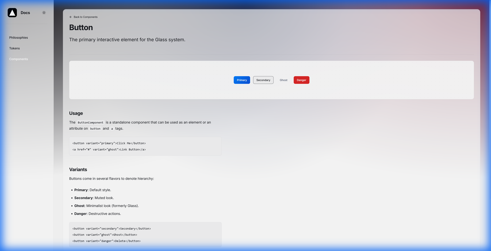

# BaseNative Workspace

> A semantic-first, glassmorphic Angular architecture for high-performance applications.

<div align="center">
  
  <h3>Nx + Angular + DaisyUI</h3>
</div>

## 🌟 Philosophy

BaseNative is built on three core pillars:

1.  **Semantic-First**: Components are accessed via semantic attributes (e.g., `<button variant="primary">`) rather than class soup.
2.  **Glass Aesthetic**: A unified "Glass" design system powered by CSS custom properties and radial gradients.
3.  **No-Prefix**: We avoid `app-*` or `lib-*` prefixes to keep templates clean and native-like.

## 🛠️ Setup & Integration

### Prerequisites

- Node.js 18+
- pnpm or npm

### Installation

```bash
npm install
```

### DaisyUI Integration

We leverage the **DaisyUI MCP** for rapid UI development.
See [DaisyUI-Integration.md](./DaisyUI-Integration.md) for workflows on how to fetch snippets and map them to our Design Tokens.

## 🚀 Key Commands

| Task      | Command                   | Description                                      |
| :-------- | :------------------------ | :----------------------------------------------- |
| **Serve** | `npm start`               | Runs the Showcase app at `http://localhost:4200` |
| **Build** | `npx nx build basenative` | Builds the component library                     |
| **Test**  | `npx nx test`             | Runs unit tests for all projects                 |
| **Lint**  | `npx nx lint`             | Runs ESLint checks                               |
| **Graph** | `npx nx graph`            | Visualizes the Nx project graph                  |

## 🏗️ Architecture

- **`apps/showcase`**: The documentation website and playground for components.
- **`libs/ui/glass`**: The core component library implementing the Glass design system.
- **`libs/primitives`**: Headless, accessible primitives (Anchor, Dialog, etc.).
- **`libs/tokens`**: The Design Token system and `ThemeService`.

## 🎨 Token Configuration

Visit the **Tokens** page in the Showcase app to interactively configure the design system. The Immersive Configurator allows you to tweak colors, spacing, and typography and see the changes reflect instantly on a live stage.
